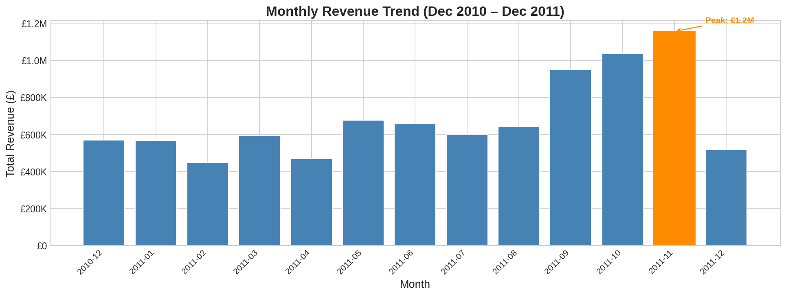
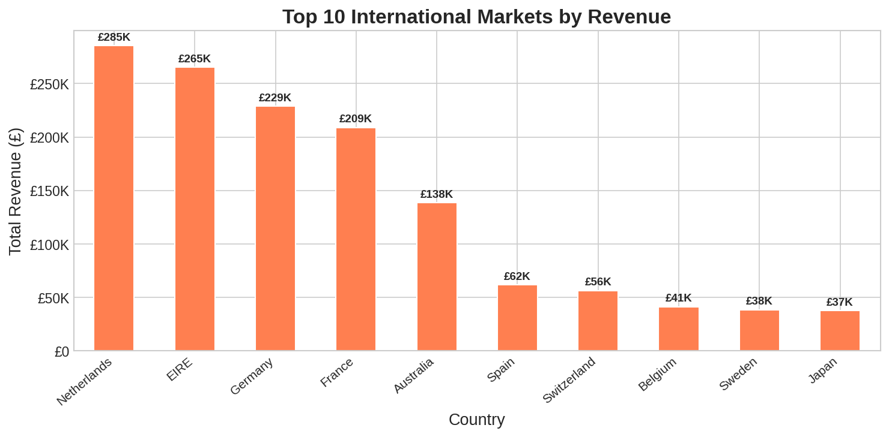
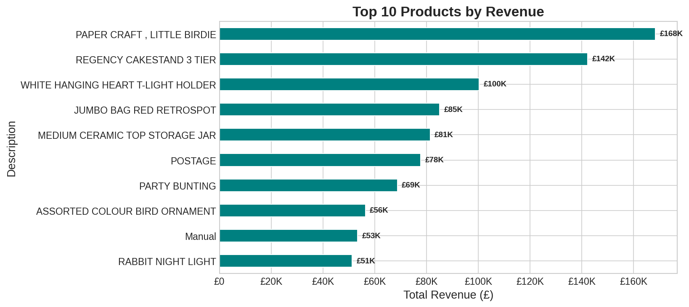
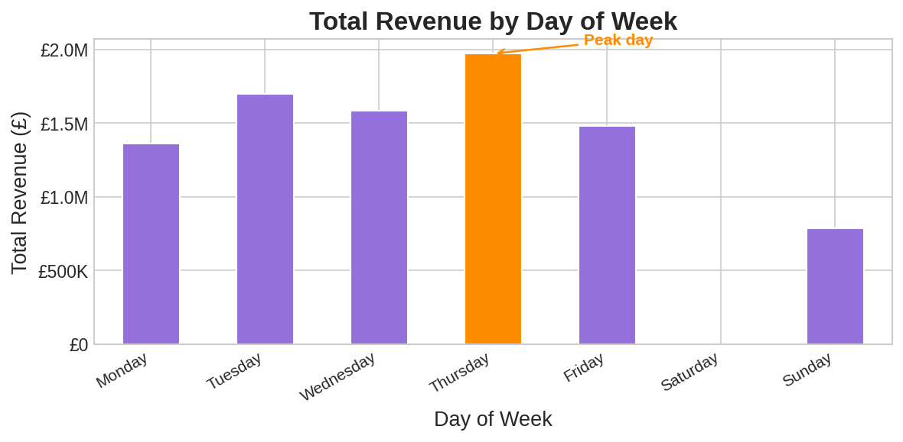
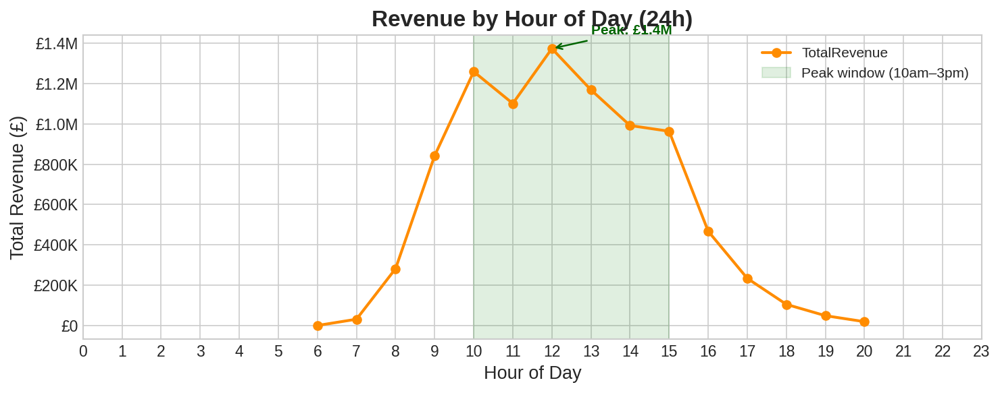
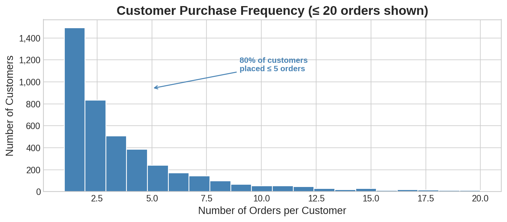
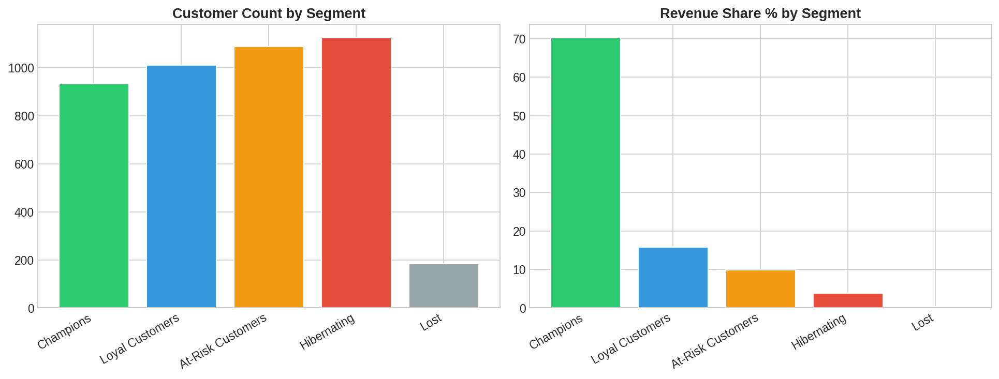
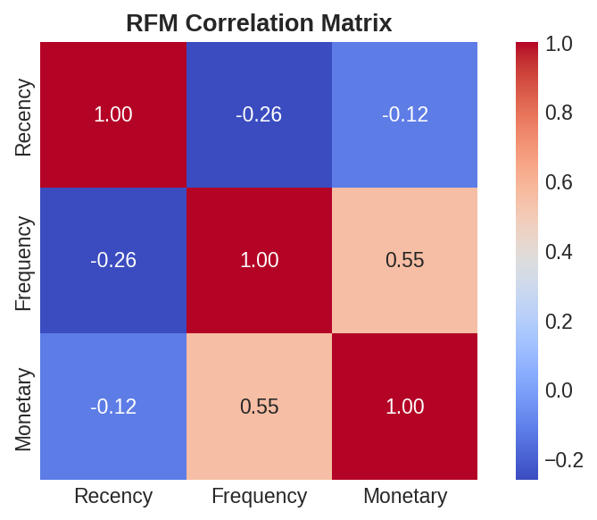
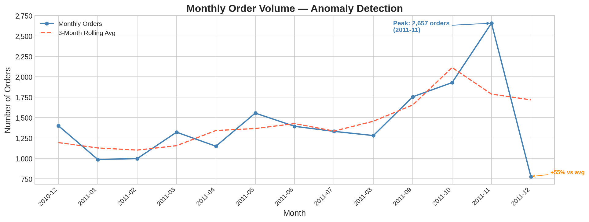
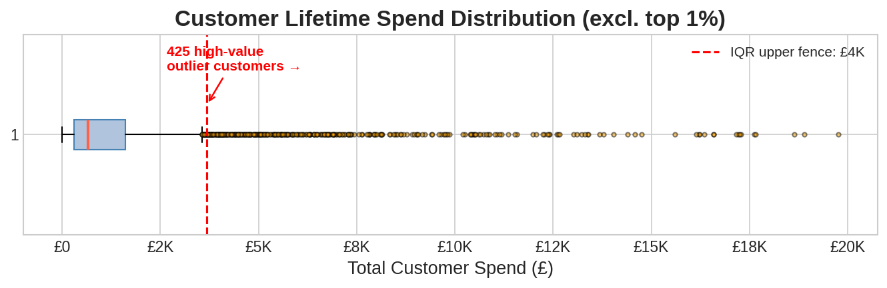

# Retail Consumer Behaviour Analysis Report

**Dataset:** Online Retail (UCI ML Repository)
**Period:** December 2010 – December 2011
**Retailer:** UK-based e-commerce, gift and homeware products
**Prepared:** April 2026

---

## Table of Contents

1. [Dataset Overview](#1-dataset-overview)
2. [Data Cleaning & Preparation](#2-data-cleaning--preparation)
3. [Exploratory Data Analysis](#3-exploratory-data-analysis)
   - 3.1 [Monthly Revenue Trend](#31-monthly-revenue-trend)
   - 3.2 [International Markets](#32-international-markets)
   - 3.3 [Top Products by Revenue](#33-top-products-by-revenue)
   - 3.4 [Revenue by Day of Week](#34-revenue-by-day-of-week)
   - 3.5 [Revenue by Hour of Day](#35-revenue-by-hour-of-day)
   - 3.6 [Customer Purchase Frequency](#36-customer-purchase-frequency)
4. [RFM Customer Segmentation](#4-rfm-customer-segmentation)
   - 4.1 [Segment Breakdown](#41-segment-breakdown)
   - 4.2 [RFM Correlation Analysis](#42-rfm-correlation-analysis)
5. [Anomaly Detection](#5-anomaly-detection)
   - 5.1 [Monthly Volume Anomalies](#51-monthly-volume-anomalies)
   - 5.2 [High-Spend Customer Outliers](#52-high-spend-customer-outliers)
6. [Key Findings & Recommendations](#6-key-findings--recommendations)

---

## 1. Dataset Overview

| Attribute | Value |
|-----------|-------|
| Raw rows | ~541,909 transactions |
| Columns | 8 (InvoiceNo, StockCode, Description, Quantity, InvoiceDate, UnitPrice, CustomerID, Country) |
| Period | Dec 2010 – Dec 2011 (13 months) |
| Countries | 38 |
| Unique SKUs | ~3,900 |
| Missing CustomerID | ~25% of raw rows |
| Cancellation invoices | ~2% (prefix "C") |
| Usable rows after cleaning | ~397,000 |

The dataset represents a B2C retailer with visible wholesale buying patterns — high weekday concentration, bulk order quantities, and a small cohort of very high-spend customers.

---

## 2. Data Cleaning & Preparation

Four cleaning rules were applied before any analysis:

| Rule | Reason | Rows affected |
|------|--------|---------------|
| Drop nulls on `CustomerID` / `Description` | Cannot segment anonymous transactions | ~25% of raw rows |
| Remove invoices prefixed `"C"` | Cancellations inflate quantity and distort revenue | ~2% of invoices |
| Filter `Quantity < 1` | Returns and data entry errors | Small fraction |
| Filter `UnitPrice < £0.01` | Free samples and test entries | Small fraction |

Three derived columns were added for analysis:

- `TotalRevenue = Quantity × UnitPrice`
- `YearMonth` — for monthly aggregation
- `DayName` / `Hour` — for intraday and day-of-week analysis

The pipeline reads `ISO-8859-1` encoding (required for special characters in product descriptions) and is fully stateless — identical input always produces identical output.

---

## 3. Exploratory Data Analysis

### 3.1 Monthly Revenue Trend

**Peak:** £1.2M in November 2011

Revenue grew steadily across the year — from ~£450K in February 2011 to £955K in September and £1.04M in October before peaking at £1.2M in November. The December 2011 figure (~£520K) is an artefact of incomplete data for that month, not a real seasonal decline. Treating December as a genuine drop-off would misrepresent the underlying trend.

**Key insight:** The growth trajectory is driven by pre-Christmas gifting demand accumulating across Q3 and Q4. The business has a strong seasonal peak that can be planned for with stock and staffing buffers from September onwards.

---

### 3.2 International Markets

The UK dominates total revenue (~82%). Among the 37 international markets, the top 10 by revenue are:

| Rank | Country | Revenue | Notes |
|------|---------|---------|-------|
| 1 | Netherlands | £285K | Highest international market; large basket sizes |
| 2 | EIRE (Ireland) | £265K | High volume, frequent orders |
| 3 | Germany | £229K | Consistent year-round demand |
| 4 | France | £209K | Strong seasonal gifting peak |
| 5 | Australia | £138K | Low order count, high spend per order |
| 6 | Spain | £62K | Moderate volume |
| 7 | Switzerland | £56K | Small but consistent |
| 8 | Belgium | £41K | |
| 9 | Sweden | £38K | |
| 10 | Japan | £37K | Notable for geographic distance |

**Key insight:** Netherlands, EIRE, and Germany collectively account for the vast majority of international revenue. Australia's high spend-per-order relative to order count suggests high-value wholesale buyers — a distinct customer profile from the European markets worth targeting separately.

---

### 3.3 Top Products by Revenue

| Rank | Product | Revenue |
|------|---------|---------|
| 1 | PAPER CRAFT, LITTLE BIRDIE | £168K |
| 2 | REGENCY CAKESTAND 3 TIER | £142K |
| 3 | WHITE HANGING HEART T-LIGHT HOLDER | £100K |
| 4 | JUMBO BAG RED RETROSPOT | £85K |
| 5 | MEDIUM CERAMIC TOP STORAGE JAR | £81K |
| 6 | POSTAGE | £78K |
| 7 | PARTY BUNTING | £69K |
| 8 | ASSORTED COLOUR BIRD ORNAMENT | £56K |
| 9 | Manual | £53K |
| 10 | RABBIT NIGHT LIGHT | £51K |

**Key insight:** The top SKU (PAPER CRAFT, LITTLE BIRDIE at £168K) represents roughly 1.8% of total revenue — no dangerous single-product dependency. The mix of decorative items, storage, and lighting confirms a gift/homeware focus. "POSTAGE" appearing as the 6th highest revenue line indicates a significant proportion of customers are paying substantial shipping costs, which may be a friction point for international conversion.

---

### 3.4 Revenue by Day of Week

| Day | Revenue | Index vs Thursday |
|-----|---------|-------------------|
| Thursday | ~£2.0M | 100% (peak) |
| Tuesday | ~£1.7M | 85% |
| Wednesday | ~£1.6M | 80% |
| Friday | ~£1.5M | 75% |
| Monday | ~£1.4M | 70% |
| Sunday | ~£800K | 40% |
| Saturday | ~£0 | ~0% |

**Key insight:** Saturday is virtually zero revenue — an extraordinary pattern for a B2C retailer that points strongly to a wholesale/trade buyer base placing orders during business hours. Thursday peaks, likely aligned with buyers ordering ahead of weekend restocking. Weekend campaigns and flash sales would reach almost no active customers under the current buying pattern.

---

### 3.5 Revenue by Hour of Day

- **Peak:** £1.4M cumulative at 12pm (noon)
- **Peak window:** 10am – 3pm (shaded green)
- **Sharp drop:** After 3pm, revenue falls steeply
- **Dead hours:** Virtually no orders before 6am or after 8pm

**Key insight:** 10am–3pm is the critical trading window — this is when the bulk of orders are placed. Email campaigns, flash sales, and time-limited promotions should be timed to land by 9–10am to catch buyers before and during peak hours. Customer service staffing should be concentrated in this window. Automated order processing outside these hours is sufficient.

---

### 3.6 Customer Purchase Frequency

- **80% of customers placed ≤ 5 orders** over the 13-month period
- The distribution is heavily right-skewed — ~1,480 customers placed only 1–2 orders
- A long tail of high-frequency buyers (>10 orders) exists but is numerically small

**Key insight:** The majority of the customer base is low-frequency, which means retention and repeat-purchase incentives have large potential upside. Converting even a fraction of the 1-2 order cohort to 3-5 orders would materially shift revenue. This also flags that the Champions segment identified in RFM is driven by a relatively small number of very active buyers.

---

## 4. RFM Customer Segmentation

RFM (Recency, Frequency, Monetary) segmentation scores each customer on three dimensions using quintiles (1–5 each), producing a composite score from 3 to 15. Customers are labelled by score range:

| Segment | Score Range | Colour |
|---------|-------------|--------|
| Champions | ≥ 13 | Green |
| Loyal Customers | 10–12 | Blue |
| At-Risk Customers | 7–9 | Orange |
| Hibernating | 4–6 | Red |
| Lost | < 4 | Grey |

### 4.1 Segment Breakdown

| Segment | Customers | Revenue Share |
|---------|-----------|---------------|
| Champions | ~940 | **70%** |
| Loyal Customers | ~1,010 | 16% |
| At-Risk Customers | ~1,080 | 10% |
| Hibernating | ~1,120 | 4% |
| Lost | ~195 | ~0% |

**Key insight:** Champions represent ~22% of the customer base but generate 70% of total revenue. This is the most critical cohort — losing even a fraction of Champions would cause a disproportionate revenue drop. Loyal Customers (16% revenue share) are the primary upgrade target; converting them to Champions is more valuable than acquiring new customers. At-Risk + Hibernating customers together number ~2,200 (~51% of the base) but contribute only 14% of revenue — re-engagement campaigns targeting these groups should be cost-efficient, not high-investment.

---

### 4.2 RFM Correlation Analysis

| Pair | Correlation | Interpretation |
|------|-------------|----------------|
| Frequency ↔ Monetary | **+0.55** | Customers who order more frequently spend more in total — the strongest relationship in the dataset |
| Recency ↔ Frequency | **−0.26** | More recent customers tend to order slightly more often — weak but expected |
| Recency ↔ Monetary | **−0.12** | Recency has almost no direct relationship with spend — very weak |

**Key insight:** The Frequency–Monetary correlation of 0.55 is the most actionable finding: increasing order frequency is the primary lever for increasing customer lifetime value. Subscription offers, reorder reminders, and loyalty perks that drive repeat visits will have a direct revenue impact. Recency alone is a poor predictor of spend.

---

## 5. Anomaly Detection

Two complementary anomaly detection methods were applied:

1. **Volume anomalies** — monthly order count vs. a 3-month centred rolling average
2. **Spend outliers** — customer lifetime spend vs. the Tukey IQR fence (Q3 + 1.5 × IQR)

### 5.1 Monthly Volume Anomalies

- **Peak month:** November 2011 — **2,657 orders**, the highest of the entire period
- **Largest negative deviation:** December 2011 — **+55% deviation** from the rolling average (i.e., orders dropped sharply versus what the trend predicted)
- The rolling average (dashed red line) shows a clear upward trend from mid-year, which makes November's absolute peak and December's sharp drop both more pronounced relative to the smoothed baseline

**Key insight:** November's spike is genuine pre-Christmas demand — stock buffers and fulfilment capacity should be expanded from October. December's collapse is partly real (basket-size shift toward lower-value gift items) and partly data incompleteness. Planning cycles should treat November as the operational peak and not expect December to sustain it.

---

### 5.2 High-Spend Customer Outliers

- **IQR upper fence:** £4K
- **Outlier customers above fence:** **425 customers**
- **Spend range of outliers:** £4K – £20K+
- The bulk of the customer base clusters between £0–£2K lifetime spend; the distribution is heavily right-skewed

**Key insight:** 425 customers (roughly 10% of the cleaned base) exceed the £4K IQR threshold — a far larger outlier cohort than a simple top-percentile cut would reveal. These customers warrant a dedicated VIP programme: priority customer service, early access to new products, and personalised account management. Losing one of these customers is equivalent to losing dozens of average customers.

---

## 6. Key Findings & Recommendations

### Revenue & Seasonality

| Finding | Recommendation |
|---------|---------------|
| Revenue peaks at £1.2M in November | Begin stock build-up and fulfilment scaling in September |
| December data is incomplete — not a real decline | Do not set targets or plans based on December's apparent drop |
| Steady Q3–Q4 growth pattern | Align marketing spend to accelerate an already growing Q3 trend |

### Geographic

| Finding | Recommendation |
|---------|---------------|
| Netherlands, EIRE, Germany drive 80% of international revenue | Dedicate localised campaigns and customer support to these three markets |
| Australia has disproportionately high spend per order | Investigate wholesale buyer profile; consider dedicated outreach |
| Saturday revenue is near zero | Do not schedule campaigns or flash sales on Saturdays |

### Product

| Finding | Recommendation |
|---------|---------------|
| Top SKU is only 1.8% of revenue — no dangerous concentration | Portfolio is healthy; focus on bundling to increase basket size |
| POSTAGE is a top-10 revenue line | Review shipping cost structure; consider free shipping thresholds to increase conversion |

### Timing

| Finding | Recommendation |
|---------|---------------|
| Peak trading window: 10am–3pm weekdays | Schedule email campaigns to arrive by 9–10am |
| Saturday is dead; Sunday is low | Concentrate all time-sensitive campaigns Mon–Fri |
| Thursday is peak day | Feature launches and promotions on Thursday will reach the most active buyers |

### Customer Segments

| Finding | Recommendation |
|---------|---------------|
| Champions (22% of customers) generate 70% of revenue | Prioritise Champions retention above all else; any churn here has outsized impact |
| Loyal Customers are the best upgrade target | Loyalty incentives, volume discounts, and early access can move this cohort to Champions |
| ~2,200 At-Risk + Hibernating customers | Low-cost re-engagement: automated win-back emails with a small incentive |
| 425 outlier customers (>£4K lifetime spend) | Establish a VIP tier with dedicated account management |
| Frequency–Monetary correlation: 0.55 | Drive repeat visits via subscriptions, reorder reminders, and loyalty points — frequency is the primary spend lever |

---

*Report generated from analysis pipeline: `analysis/clean.py`, `analysis/explore.py`, `analysis/segment.py`, `analysis/anomaly.py`*
*Charts: `outputs/charts/`*
